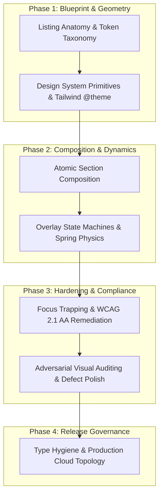

# Specialized Multi-Agent Systems Architecture & Execution Blueprint

This document specifies the operational taxonomy, role responsibilities, inter-agent communication contracts, and sequential execution pipeline governing the development and automated verification of the **PlayPowerLabs Airbnb Vacation Rental Platform**.

---

## 1. Architectural Philosophy & Agent Decomposition

Constructing a production-tier, high-fidelity web application with enterprise-grade responsiveness, full keyboard operability, resilient overlay state management, and cloud-native backend topologies exceeds the cognitive bandwidth of a single unstructured prompt. 

To eliminate hallucination risk, prevent scope drift, and ensure uncompromising code quality, our engineering strategy utilizes a **modular multi-agent delegation pattern**. The software development lifecycle is factored across six specialized agent personas, each constrained to a singular domain of competence:

1. **Visual Systems & Layout Specialist (`.claude/agents/ui-agent.md`)**:
   - Oversees design token architecture, CSS grid geometries, container constraints (1280px viewport bounds), responsive typography scales, and visual hierarchy matching Airbnb design tokens.
2. **Interactive State & Motion Engineer (`.claude/agents/interaction-agent.md`)**:
   - Manages client-side state transitions, finite overlay state machines, Framer Motion spring physics, keyboard event propagation, and modal orchestration (Full-Screen Photo Tour, Categorized Lightbox).
3. **Universal Accessibility (a11y) Advocate (`.claude/agents/accessibility-agent.md`)**:
   - Champions WCAG 2.1 Level AA and WAI-ARIA compliance, implementing strict programmatic focus trapping, bi-directional focus restoration, semantic landmarks, screen-reader text alternatives, and reduced-motion ergonomics.
4. **Adversarial Visual QA Auditor (`.claude/agents/visual-qa-agent.md`)**:
   - Serves as an independent evaluation gate, performing systematic visual diffing against source references, triaging visual anomalies across severity bands (P0 blocker to P3 cosmetic), and enforcing zero-regression thresholds.
5. **Cloud Systems & Infrastructure Architect (`.claude/agents/architecture-agent.md`)**:
   - Formulates the global cloud topology, including multi-AZ containerized runtimes, distributed caching hierarchies, event streaming backbones, and ACID-compliant storage layers.
6. **Static Analysis & Type Integrity Lead (`.claude/agents/code-review-agent.md`)**:
   - Enforces strict TypeScript invariants (`verbatimModuleSyntax: true`), eliminates loose typings (`any`), ensures modular component isolation, and validates zero-warning lint compliance.

---

## 2. Cross-Agent Operational Handoff Matrix

| Specialist Persona | Core Mandate | Upstream Inputs | Downstream Deliverables | Acceptance Criteria |
| :--- | :--- | :--- | :--- | :--- |
| **Visual Systems & Layout** | Token definitions, container sizing, Tailwind v4 architecture | Design references & layout specifications | Reusable UI primitives (`Button`, `Modal`, `Section`) | Exact pixel parity & container alignment |
| **Interactive State & Motion** | Overlay transitions, dynamic pricing, gesture response | Static component scaffolding | Animated interactive views & state hooks | 60fps animations & seamless gesture flow |
| **Accessibility Advocate** | WCAG 2.1 AA conformance, keyboard routing, ARIA trees | Interactive components | Focus traps, ARIA attributes, keyboard handlers | Complete screen-reader & keyboard operability |
| **Visual QA Auditor** | Discrepancy analysis, layout audits, visual regression | Assembled interactive page | Defect audit log & remediation tickets | 0 unresolved P0/P1 visual discrepancies |
| **Static Analysis & Types** | Strict typing compliance, linter hygiene, dead code pruning | Polished feature branches | Clean, typechecked production code | 0 TypeScript errors & clean lint passes |
| **Cloud Architect** | Distributed systems modeling & infrastructure design | Platform scalability targets | Multi-AZ cloud architecture diagram & spec | Resilient high-concurrency cloud blueprint |

---

## 3. Sequential Implementation & Verification Pipeline



### Stage Breakdown

- **Stage 1 — Domain Anatomy & Structural Deconstruction**: Reverse-engineering the listing taxonomy, defining container width rules (1280px standard container), typographic scales (Inter), and strongly typed domain entities.
- **Stage 2 — Design System Tokenization & Core Primitives**: Establishing custom Tailwind CSS v4 `@theme` properties in `src/index.css` and implementing polymorphic component primitives (`Button`, `IconButton`, `Modal`, `Section`).
- **Stage 3 — Full Page Assembly**: Top-down integration of all listing sections: Navigation Header, Title Row, Bento Photo Grid, Listing Metadata, Host Badging, Sleeping Arrangements, Amenities Matrix, Dual-Month Calendar, Reviews Breakdown, Map Cartography, Host Overview, Policies, Curated Stays, and Sticky Booking Card.
- **Stage 4 — Overlay Engineering & Motion Choreography**: Crafting the room-by-room Photo Tour modal and full-screen Lightbox viewer with direction-aware slide animations, counter state, and scroll locking.
- **Stage 5 — Accessibility Remediation & Keyboard Loops**: Embedding cyclical focus traps (`Tab` / `Shift+Tab`), `Escape` dismiss listeners, `ArrowLeft` / `ArrowRight` image stepping, and active element restoration.
- **Stage 6 — Visual Quality Assurance & Polish**: Conducting side-by-side visual comparisons against reference criteria, resolving spacing discrepancies, and refining hover micro-interactions.
- **Stage 7 — Cloud Topology Modeling & Verification**: Synthesizing the production-grade distributed architecture (PDF, PNG, SVG) and executing clean typecheck and build validation.

---

## 4. Persona Configuration Registry

Specialized persona instructions and operational prompts are cataloged in `.claude/agents/` and mirrored in `ai-workflow/`:

```
.claude/
├── agents/
│   ├── ui-agent.md              # Token engineering, Tailwind rules & layout math
│   ├── interaction-agent.md     # Overlay state choreography & keyboard dynamics
│   ├── accessibility-agent.md   # WAI-ARIA roles, focus traps & screen-reader compatibility
│   ├── visual-qa-agent.md       # Defect classification rubrics & visual verification
│   ├── architecture-agent.md    # Multi-tier cloud platform topology & resilience
│   └── code-review-agent.md     # Strict TypeScript paradigms & lint governance
└── skills/
    ├── visual-qa-audit.md       # Visual verification procedures
    ├── accessibility-audit.md   # Keyboard trapping & ARIA checklists
    └── build-verification.md    # Build and compilation sign-off runbooks
```

---

## 5. Release Quality Protocol & Sign-off Criteria

Before any code merge or final candidate packaging, the repository must satisfy the following non-negotiable verification gates:

1. **Clean Static Analysis**: Execution of `npm run lint` must exit with **0 errors and 0 warnings**.
2. **Deterministic Compilation**: Execution of `npm run build` (`tsc -b && vite build`) must compile cleanly with zero type errors.
3. **Keyboard Flow Operability**: Complete manual verification of `Tab`, `Shift+Tab`, `Escape`, `ArrowLeft`, and `ArrowRight` workflows.
4. **Focus Containment & Restoration**: Verified absence of focus leakage in active modals, with guaranteed focus return to triggering buttons upon dismissal.
5. **Viewport Responsiveness**: Impeccable rendering across desktop, tablet, and mobile breakpoints without layout shift or horizontal overflow.
