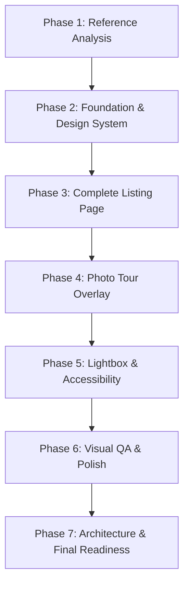

# AI-Assisted Engineering Workflow

This directory documents the specialized AI agent configurations, operational roles, and prompt progression utilized to construct the **PlayPowerLabs Airbnb Clone**.

---

## Why These Agents Exist

Building an internet-scale frontend with pixel-perfect visual fidelity, full keyboard accessibility, complex overlay state machines, and microservices architecture requires distinct engineering perspectives. Rather than relying on a single generic prompt, our development framework decomposes the engineering lifecycle into six specialized agent personas:

1. **UI Agent (`ui-agent.md`)**: Focuses exclusively on visual precision, design tokens, Tailwind CSS styling, exact container widths, and vertical layout rhythms.
2. **Interaction Agent (`interaction-agent.md`)**: Focuses on state transitions, Framer Motion animations, keyboard event orchestration, and full-screen overlays (Photo Tour, Lightbox).
3. **Accessibility Agent (`accessibility-agent.md`)**: Enforces WAI-ARIA standards, semantic landmarks, focus trapping, focus restoration, screen reader compatibility, and motion sensitivity.
4. **Visual QA Agent (`visual-qa-agent.md`)**: Acts as a strict adversary comparing the implementation against reference designs, classifying discrepancies (P0–P3), and driving iterative refinement.
5. **Architecture Agent (`architecture-agent.md`)**: Designs the production-scale distributed systems architecture, caching strategies, event-driven pipelines, and cloud infrastructure.
6. **Code Review Agent (`code-review-agent.md`)**: Guards code health, TypeScript correctness (`verbatimModuleSyntax`), linter compliance, and modular component boundaries.

---

## Agent Complementarity Matrix

| Agent | Primary Concern | Consumes From | Hands Off To |
| :--- | :--- | :--- | :--- |
| **UI Agent** | Design Tokens & Layouts | Reference Site & Specs | Interaction Agent |
| **Interaction Agent** | Dynamic State & Animations | Static UI Components | Accessibility Agent |
| **Accessibility Agent** | a11y, ARIA, Keyboard Trapping | Interactive Components | Visual QA Agent |
| **Visual QA Agent** | Regression Audits & Pixel Polish | Built Pages | Code Review Agent |
| **Code Review Agent** | Type Safety & Linting | Refined Codebase | Build & Production |
| **Architecture Agent** | Production Scalability Diagram | High-level System Reqs | Submission Artifacts |

---

## The Phased Development Workflow

1. **Phase 1: Reference Anatomy**: Reverse-engineer page hierarchy, container constraints (1280px), typography scales, and listing data structure.
2. **Phase 2: Foundation & Design Tokens**: Define Tailwind CSS v4 `@theme` tokens in `src/index.css` and build primitive components (`Button`, `IconButton`, `Modal`, `Section`).
3. **Phase 3: Core Page Assembly**: Construct the listing top-to-bottom: Header, Title, Hero Bento Grid, Listing Metadata, Guest Favourite Badge, Highlights, Description, Sleeping, Amenities, Calendar, Reviews, Location, Host, Things to Know, Nearby Listings, and Sticky Reservation Card.
4. **Phase 4 & 5: Gallery & Lightbox Transitions**: Build the full-screen Photo Tour overlay and Lightbox single-photo viewer with Framer Motion and keyboard controls.
5. **Phase 6: Visual QA & a11y Remediation**: Rigorously audit visual discrepancies, ensure focus trapping and focus restoration, and eliminate all P0/P1 issues.
6. **Phase 7: System Architecture & Verification**: Model production-scale distributed architecture (PNG/PDF) and run final `npm run build` and `oxlint` verification.

---

## Complete Prompt Log
For the exhaustive chronological prompt log and output records, see [`prompts.md`](./prompts.md).
